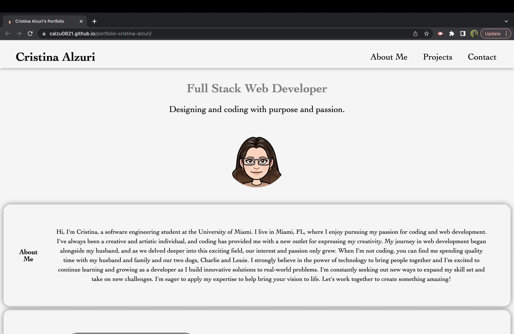
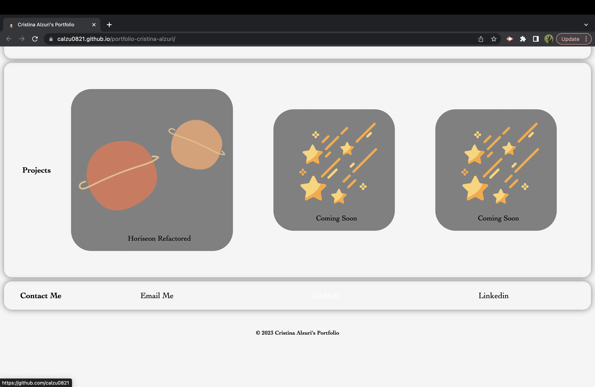

# portfolio-cristina-alzuri

## Description

This project is my personal portfolio page built from scratch using HTML and CSS. The main purpose of this page is to showcase my skills and talents to hiring managers, highlighting my strongest work as well as the thought process behind it. 

The motivation behind this project is to set myself up for future success by applying the core skills I've recently learned: flexbox, media queries, and CSS variables. By practicing my new skills while creating something that I will use during my job search.

Through this project, I learned how to apply flexbox and media queries to make the page responsive and how to use CSS variables to make the code more organized and easier to maintain.

## Installation

Follow these steps to install this project:

1. Clone the repository on your local machine using the following command:

git clone https://github.com/calzu0821/portfolio-cristina-alzuri.git

2. Open the index.html file in your web browser to view the webpage.

## Usage

To view this portfolio, simply open the index.html file in your web browser. The page is fully responsive and adapts to various screens and devices. You can click on the links in the navigation to scroll to the corresponding sections of the page. The UI also scrolls to the corresponding section when the links are clicked. You can also click on the images of the applications to be taken to that deployed application.

Deployed website:

 https://calzu0821.github.io/portfolio-cristina-alzuri/

Screenshot of the portfolio website:

  

## Credits

I used the following third-party assets in this project:

- https://www.bitmoji.com/
- https://www.flaticon.com/
- https://htmlcolorcodes.com/
- https://cssdeck.com/blog/what-is-a-css-reset/
- https://www.browserstack.com/guide/how-to-implement-mobile-first-design
- https://youtu.be/2KL-z9A56SQ
- https://youtu.be/fYq5PXgSsbE
- https://youtu.be/fWnXVwULqrE
- https://youtu.be/GNmz5dYjdcQ

## License

N/A
